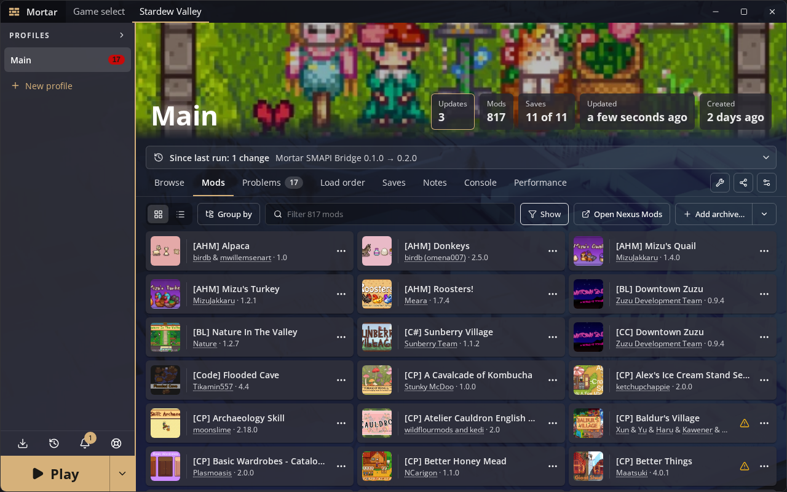
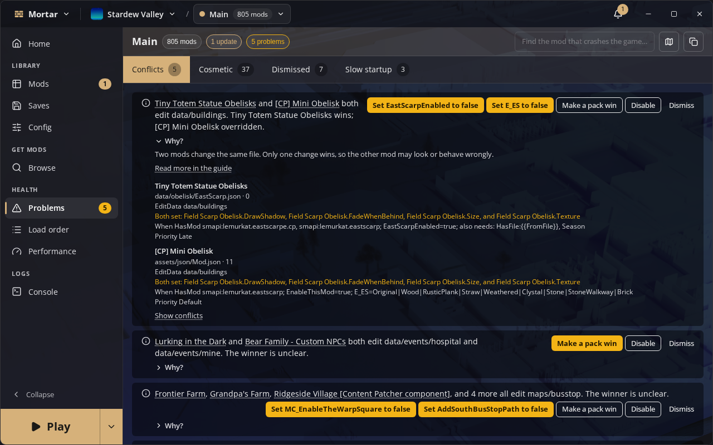
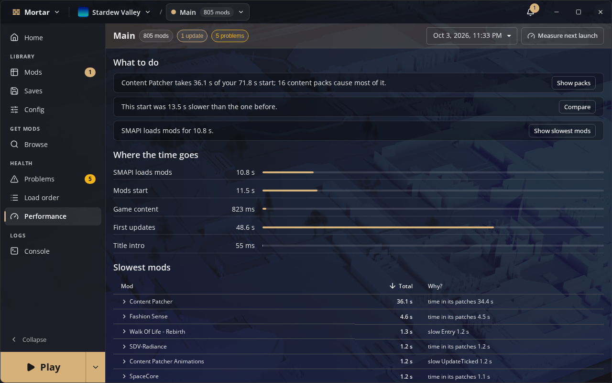
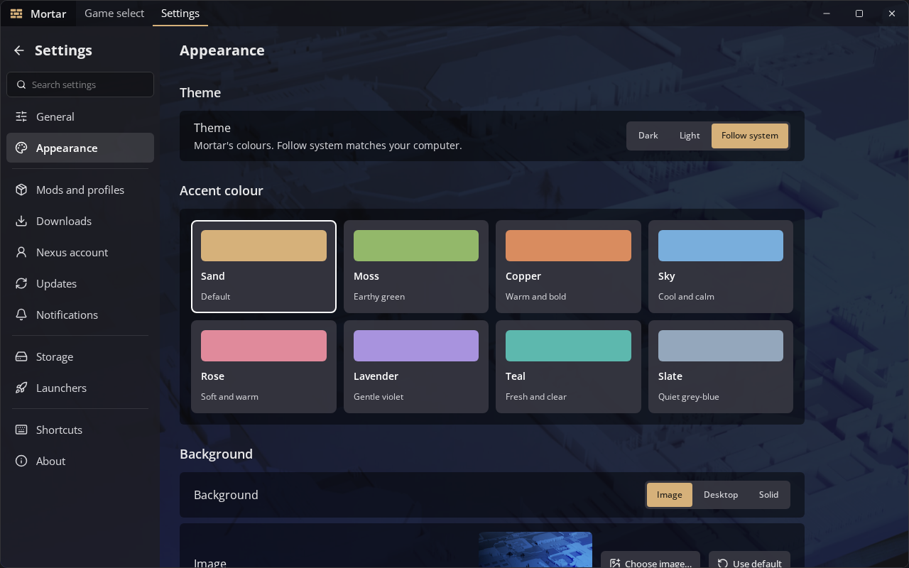

<h1 align="center">Mortar</h1>

<div align="center">

 

</div>

---

Mortar is a desktop mod manager, built for more than one game. It finds your game, installs its mod loader, keeps each set of mods in its own profile, and launches the game with the profile you pick. A profile is shared as a link: whoever opens it gets the same mods, with anything missing installed or queued and every dependency checked.

The games Mortar supports come from its catalog: Stardew Valley today, with mods from Nexus Mods, GitHub and Thunderstore. Mortar succeeds [Concrete](https://github.com/LethalModding/Concrete).

<p align="center"></p>

## Getting started

Download from [mortar.rethunk.tech/download](https://mortar.rethunk.tech/download/), which has the steps for each channel: signed apt, dnf, pacman and Flatpak repositories, a [Scoop bucket](https://github.com/Rethunk-Tech/scoop-bucket) and a [Homebrew tap](https://github.com/Rethunk-Tech/homebrew-tap). Or take a file from [Releases](https://github.com/Rethunk-Tech/mortar/releases/latest): a Windows installer (x64 or ARM64), or for Linux an AppImage, portable program, Flatpak, `.deb`, `.rpm` or Arch package. The AppImage and portable program need Ubuntu 24.04, Debian 13, Fedora 39 or newer (glibc 2.38); on older systems use the Flatpak. Mortar finds Stardew Valley from Steam, GOG, Heroic or Lutris and installs SMAPI itself. The [user guide](docs/user-guide.md) walks through installing, first run, Nexus sign-in, profiles, backups and troubleshooting. The Windows builds are not code-signed, so SmartScreen warns the first time one runs: choose **More info**, then **Run anyway**.

The optional browser extension marks Nexus Mods pages with what a profile already has and hands Mod Manager Download clicks to Mortar. It lives in its own repo, [Rethunk-Tech/mortar-browser-extension](https://github.com/Rethunk-Tech/mortar-browser-extension). Its [latest release](https://github.com/Rethunk-Tech/mortar-browser-extension/releases/latest) carries a signed `mortar-browser-extension.xpi` for Firefox and `mortar-browser-extension.zip` for Chrome, Edge and other Chromium browsers (unzip it, open `chrome://extensions`, turn on Developer mode and choose **Load unpacked**); Settings › Downloads links both.

To build it yourself:

```sh
bun install && wails3 dev
```

Prerequisites (including the `wails3` CLI built from the pinned Wails fork), build and gate: [HUMANS.md](HUMANS.md).

## Features

- Discovers the games in its catalog (Stardew Valley today) on Steam (including Flatpak Steam), GOG, Heroic, Minigalaxy, Lutris and Bottles, and installs each game's mod loader.
- Keeps each set of mods in its own profile, with install, update, rollback and share as a link or `.mortar` file.
- Downloads from Nexus Mods, GitHub, Thunderstore, Modrinth and itch.io for the games that list them; never re-hosts mod files.
- Edits a mod's config as a typed form, can keep a profile's saves separate, and shares profiles between your computers through a sync folder.
- A command line for the running app: `mortar games`, `mortar mods stardew "My Farm"`, `mortar conflicts ...`, with `--json` for scripts.
- Installs the [Mortar SMAPI Bridge](https://github.com/Rethunk-Tech/mortar-smapi-bridge) into each profile: console commands from Mortar, Generic Mod Config Menu settings, and a stream overlay. Games on BepInEx get the [Mortar BepInEx Bridge](https://github.com/Rethunk-Tech/mortar-bepinex-bridge) instead, which lets Mortar ask the running game which plugins it has loaded.

## Screenshots

<table>
<tr><td align="center"><br><sub>Problems: content conflicts explained, with one-click fixes</sub></td><td align="center"><br><sub>Performance: what each mod costs at startup</sub></td></tr>
<tr><td align="center" colspan="2"><br><sub>Themes, accent colours and the window background</sub></td></tr>
</table>

## Documentation

| Topic | Location |
| --- | --- |
| Using Mortar | [docs/user-guide.md](docs/user-guide.md) |
| How it works | [docs/architecture.md](docs/architecture.md) |
| Decided work not yet built | [docs/design.md](docs/design.md) |
| Screens and styling | [docs/gui-design.md](docs/gui-design.md) |
| Run, build, gate | [HUMANS.md](HUMANS.md) |
| Contributing | [CONTRIBUTING.md](CONTRIBUTING.md) |
| Security policy | [SECURITY.md](SECURITY.md) |
| Rules for agents | [AGENTS.md](AGENTS.md) |
| Licence | [LICENSE](LICENSE) |

## Licence

Licensed under the [GNU Affero General Public License v3.0](LICENSE).

Not affiliated with any game developer or mod site.
